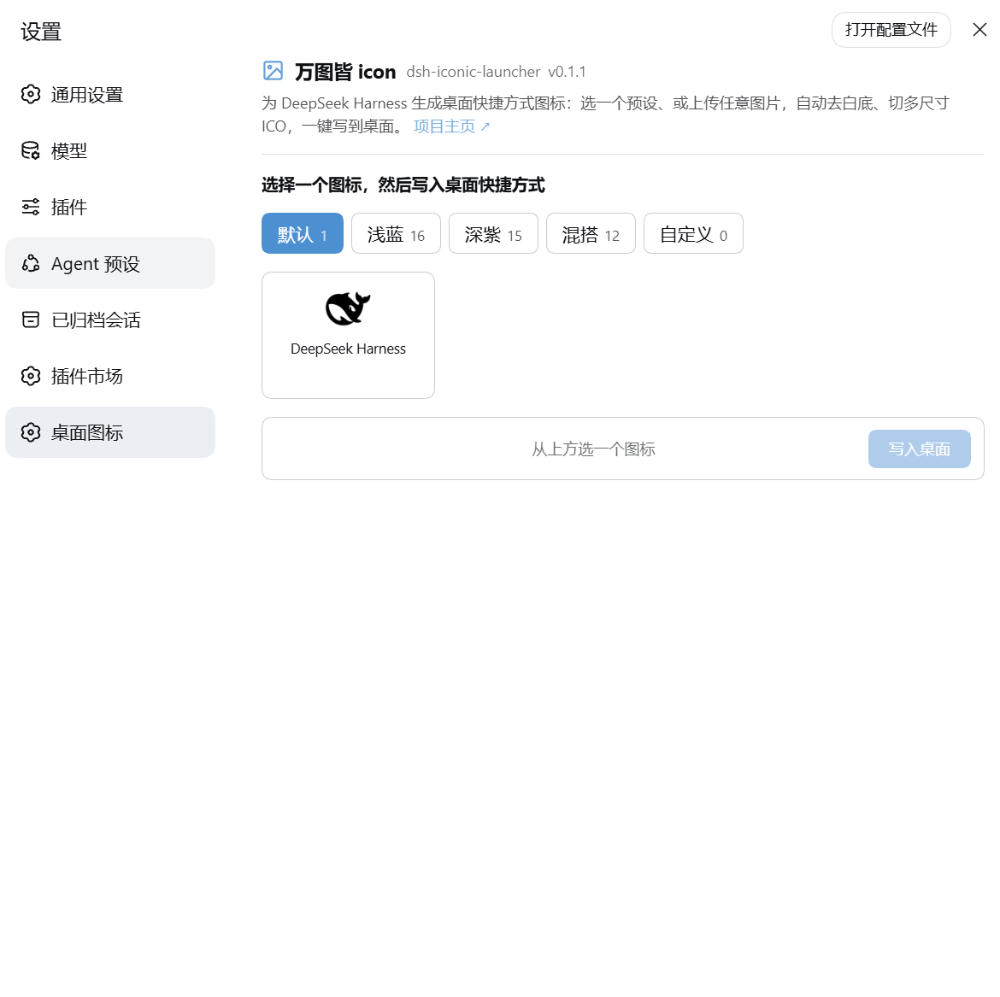
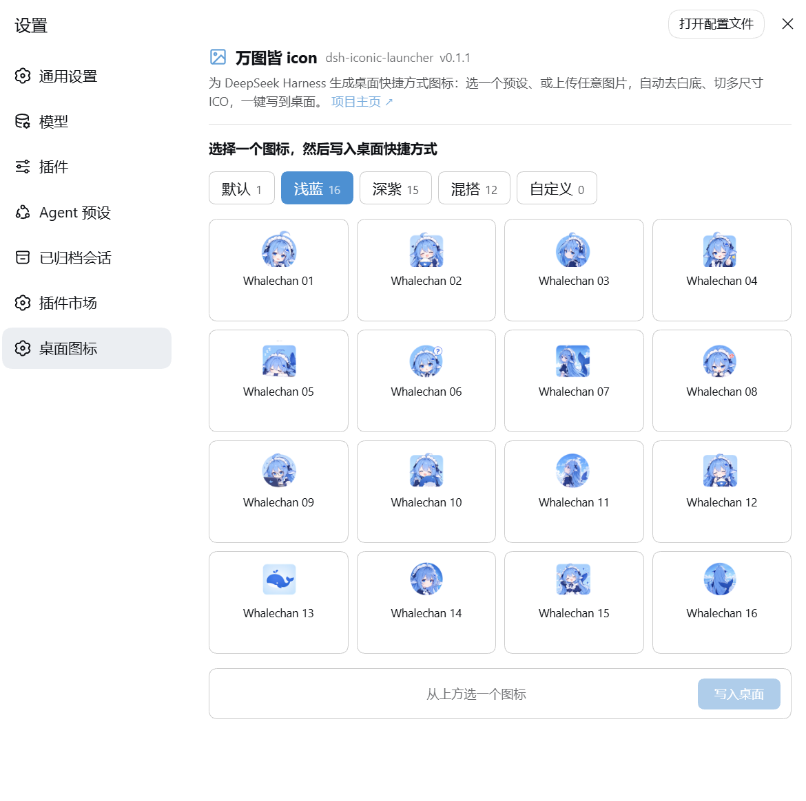

# dsh-iconic-launcher

Portable launcher toolchain for **DeepSeek Harness** (`deepseek-harness`) on
Windows. It turns the Web UI into a **one-click desktop shortcut with a real
icon**, so you never have to type the long startup command again.

## Preview / 预览

<table>
  <tr>
    <td align="center" width="50%">
      
      <br><sub>设置页首页（顶部项目信息 + 默认分组）</sub>
    </td>
    <td align="center" width="50%">
      
      <br><sub>浅蓝分组（16 个预设图标）</sub>
    </td>
  </tr>
</table>

## Why this exists / 初衷

DeepSeek Harness normally starts with a familiar but tedious ritual — open a
terminal, `cd` into your checkout, then run a long command with the right flags
and environment. That gets old fast, especially after a re-clone or on a new
machine.

This project is deliberately **not** in the upstream repo. It is a small,
separate, self-contained layer that only:

- creates a desktop shortcut (with a real icon) that runs DeepSeek Harness;
- regenerates that icon from an SVG when you need it;
- restores everything after you re-clone the upstream repo.

It **does not modify, patch, or rebuild DeepSeek Harness core code**. The
upstream stays untouched and upstream-clean — the launcher only wraps its
startup. In short: one less thing to type, zero risk to the product.

Because it lives in its **own repository** (not inside the harness checkout),
re-cloning the harness tree never wipes it: the moment you re-clone, you run
`deploy.ps1` and the shortcut (and its icon) are back in seconds.

## Install / 安装

Needs a working **DeepSeek Harness** with the `dsh` CLI. The repo root **is** the
plugin package, so either method installs the same thing. / 需要已装好
**DeepSeek Harness** 并有 `dsh` 命令。仓库根就是插件包,两种方式装的是同一个东西。

**A. From GitHub — recommended; this is what the plugin market uses.**
Installs straight from source (the plugin has no build step). / 直接从源码安装
(插件无构建步骤),插件市场走的就是这条。

```powershell
dsh plugin add --profile <name> github:SkyblueeeLabs/dsh-iconic-launcher

# Pin a release instead of tracking the default branch:
dsh plugin add --profile <name> github:SkyblueeeLabs/dsh-iconic-launcher#v0.1.1
```

**B. From a prebuilt tarball — offline / air-gapped.**
Get `dsh-iconic-launcher-<version>.tgz` from the GitHub **Releases** page, or
build your own with `npm pack` in a clone, then point `dsh` at the file. /
从 GitHub **Releases** 下载 `.tgz`,或在克隆里 `npm pack` 自己产出,再指向该文件。

```powershell
dsh plugin add --profile <name> C:\path\to\dsh-iconic-launcher-0.1.1.tgz
```

After installing, restart the web app (`dsh web`) and open
**设置 → 桌面图标** (or **插件 → 插件配置**) to pick or upload a desktop icon.
/ 装完重启 `dsh web`,在 **设置 → 桌面图标**(或 **插件 → 插件配置**)里选图 / 上传。

## Layout

| Path | Purpose |
|------|---------|
| `scripts/start-dsh-web.bat` | Portable launcher. Locates `node` on PATH (or `DSH_NODE_DIR`) and runs `dsh web` via the tsx/esm entry (`node --import tsx/esm .../apps/cli/src/bin.ts web`). Logs every step to `scripts/launcher.log`. |
| `scripts/dsh-icon.ico` | Multi-resolution icon shown on the desktop shortcut. |
| `scripts/convert-svg-to-ico.mjs` | SVG → multi-size `.ico` writer (16–256), no build deps beyond `sharp`. |
| `scripts/generate-icon.ps1` | Rebuilds `dsh-icon.ico` from an SVG (probes a `sharp` install). |
| `scripts/create-desktop-shortcut.ps1` | Creates/refreshes the desktop `.lnk` pointing at `start-dsh-web.bat` with `dsh-icon.ico`. |
| `scripts/SETUP-SHORTCUT.md` | Full setup / troubleshooting notes. |
| `deploy.ps1` | One-shot restore: copies `scripts/` back into a DeepSeek Harness checkout and refreshes the shortcut. |
| `install.ps1` | One-shot install for a new user: build a fresh `deepseek-harness` checkout, generate the icon, create the shortcut. |
| repo root | **`dsh-iconic-launcher`** — the DSH plugin itself (host half + browser settings card): pick or upload a desktop shortcut icon, auto backdrop-removal, multi-size ICO, one-click `.lnk` write. |
| `data/` | PNG icon source material (also usable as extra presets via the plugin). |

## Quick use

### Restore after re-cloning the upstream repo

```powershell
# from anywhere, point at your harness checkout (auto-detected or -RepoRoot)
./deploy.ps1 -RepoRoot "C:\where\you\cloned\deepseek-harness"
```

### First-time setup (new machine)

```powershell
./install.ps1            # clone upstream + install icon + create shortcut
```

### Rebuild just the icon

```powershell
powershell -ExecutionPolicy Bypass -File ./scripts/generate-icon.ps1
powershell -ExecutionPolicy Bypass -File ./scripts/create-desktop-shortcut.ps1
```

### Custom desktop shortcut icon plugin (web UI)

The plugin adds a "pick or upload a desktop shortcut icon" capability that runs
inside the DeepSeek Harness web app. Install it either way shown in
[**Install / 安装**](#install--安装) above. See [`docs/plugin.md`](docs/plugin.md)
for routes, config, and current status. The `scripts/` and `data/` folders are
development tooling and source material — they are not part of the installed
package.

## Requirements

- Windows 10/11, PowerShell 5.1+ (or PowerShell 7).
- Node.js on PATH (the launcher also probes `%ProgramFiles%\nodejs` and
  `%LOCALAPPDATA%\Programs\nodejs`; override with `DSH_NODE_DIR`).
- `sharp` only if you need to rebuild the icon (optional).

## License

MIT. The icon is derived from DeepSeek Harness's own favicon (MIT).

## Notes / caveats

- These files are intentionally **not** part of the upstream repository. Do not
  commit them there; keep them here and push to your own fork instead.
- The desktop shortcut references the icon and the launcher by **absolute
  path** under your checkout; after re-cloning, re-run `deploy.ps1` so the
  shortcut re-points correctly.