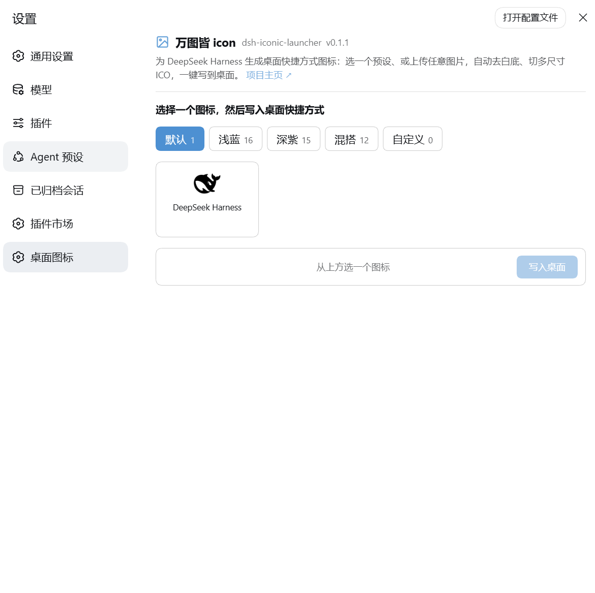
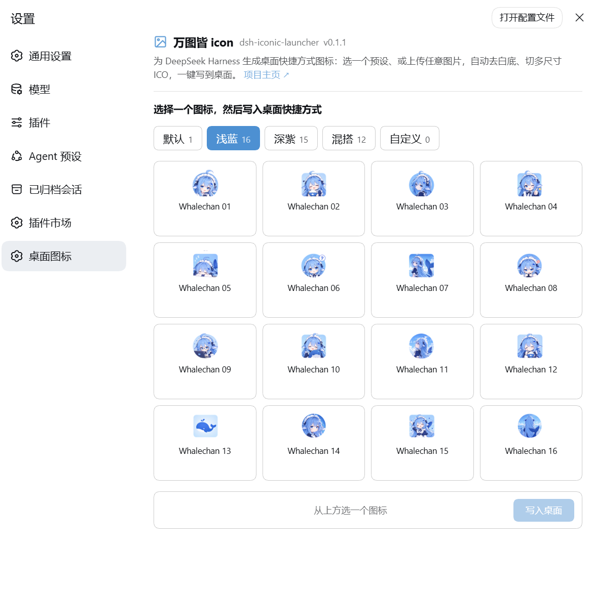

# dsh-iconic-launcher

Desktop-icon plugin for the **DeepSeek Harness desktop client** on Windows. It
gives the client's own desktop shortcut a **real icon you choose** — pick one of
the shipped presets or upload any PNG.

> **Host: the DeepSeek Harness desktop client / 目标宿主：桌面客户端**
>
> This plugin serves the official **desktop client** only. The shortcut it writes
> launches the client itself, and the launch path is resolved at runtime, so no
> machine-specific path is configured anywhere. The earlier `dsh web` /
> command-line form is no longer maintained. / 本插件只服务于官方**桌面客户端**，
> 不再维护面向 `dsh web` 命令行的形态。生成的快捷方式直接启动客户端本身，启动路径在
> 运行期解析，配置里不写死机器相关路径。
>
> **An official client update resets the icon — re-write it, do not reinstall /
> 官方更新后重新写入即可，不需要重装**
>
> The client's installer recreates its **own** desktop shortcut when it updates,
> which resets the icon to the default. The plugin and your chosen icons live in
> user data — `~/.dsh/profiles/desktop/node_modules/dsh-iconic-launcher` and
> `~/.dsh-launcher/icons` — and the update leaves both untouched. So after an
> update: open **Settings → Desktop icon (设置 → 桌面图标)**, pick your icon and
> install again (~2 seconds). **No plugin reinstall is needed.** The card does not
> remember the previous choice, so re-pick the same image. / 客户端安装包在更新时会
> 重建它**自己**的桌面快捷方式，把图标换回默认；而插件本体与图标文件都放在用户数据
> 目录里，更新不会动它们。更新后打开 **设置 → 桌面图标** 重新选图并安装即可
> （约两秒），**不需要重装插件**。卡片不记忆上次选择，重新选同一张图即可。

## Preview / 预览

<table>
  <tr>
    <td align="center" width="50%">
      
      <br><sub>设置页首页（顶部项目信息 + 默认分组）</sub>
    </td>
    <td align="center" width="50%">
      
      <br><sub>浅蓝分组（16 个预设图标）</sub>
    </td>
  </tr>
</table>

## Why this exists / 初衷

> This repository holds two things: the **plugin** (the repo root — desktop client
> only, as described above) and the older **portable launcher scripts**
> (`scripts/`, `data/`, `deploy.ps1`, `install.ps1`) that the original `dsh web`
> workflow used. The section below describes that original toolchain; it is kept
> as-is and is **not** part of the installed plugin. / 本仓库包含两部分：**插件**
> （仓库根，只服务桌面客户端，见上）和早期的**便携启动脚本**（`scripts/`、`data/`、
> `deploy.ps1`、`install.ps1`，服务于最初的 `dsh web` 流程）。下面这段讲的是那套
> 原始工具链，保持原样，**不属于插件**。

DeepSeek Harness normally starts with a familiar but tedious ritual — open a
terminal, `cd` into your checkout, then run a long command with the right flags
and environment. That gets old fast, especially after a re-clone or on a new
machine.

This project is deliberately **not** in the upstream repo. It is a small,
separate, self-contained layer that only:

- creates a desktop shortcut (with a real icon) that runs DeepSeek Harness;
- regenerates that icon from an SVG when you need it;
- restores everything after you re-clone the upstream repo.

It **does not modify, patch, or rebuild DeepSeek Harness core code**. The
upstream stays untouched and upstream-clean — the launcher only wraps its
startup. In short: one less thing to type, zero risk to the product.

Because it lives in its **own repository** (not inside the harness checkout),
re-cloning the harness tree never wipes it: the moment you re-clone, you run
`deploy.ps1` and the shortcut (and its icon) are back in seconds.

## Install / 安装

> **Platform / 平台**：Windows only（快捷方式依赖 Windows 的 `.lnk` / PowerShell）。

Install the plugin **into the desktop client**: open its **Plugins** page
(插件 → 插件市场 / 插件配置) and add this repository as the source. / 在**桌面客户端**
里安装：打开客户端的 插件 页面，用下面的源码地址添加。

```
github:SkyblueeeLabs/dsh-iconic-launcher
```

Offline or air-gapped? Use the `dsh-iconic-launcher-<version>.tgz` from the GitHub
**Releases** page instead — `npm pack` in a clone produces the same file. /
离线场景用 GitHub **Releases** 里的 `.tgz`（在克隆里 `npm pack` 产出的是同一个包）。

> ⚠️ **`dsh plugin --profile desktop …` does not work.** The `desktop` profile is
> reserved for the client, and the CLI refuses it with *"profile desktop is
> managed exclusively by the Electron application"*. Install through the
> client's own plugin manager. / 桌面 profile 由客户端独占，命令行会直接拒绝，
> 请走客户端界面安装。

After installing, **restart the desktop client** and open
**设置 → 桌面图标** (or **插件 → 插件配置**) to pick or upload an icon. The shortcut
lands on your desktop and launches the client itself. / 装完**重启桌面客户端**，在
**设置 → 桌面图标**（或 **插件 → 插件配置**）里选图 / 上传；快捷方式会落在桌面，
并且直接启动客户端本身。

## Layout

| Path | Purpose |
|------|---------|
| `scripts/start-dsh-web.bat` | Portable launcher. Locates `node` on PATH (or `DSH_NODE_DIR`) and runs `dsh web` via the tsx/esm entry (`node --import tsx/esm .../apps/cli/src/bin.ts web`). Logs every step to `scripts/launcher.log`. |
| `scripts/dsh-icon.ico` | Multi-resolution icon shown on the desktop shortcut. |
| `scripts/convert-svg-to-ico.mjs` | SVG → multi-size `.ico` writer (16–256), no build deps beyond `sharp`. |
| `scripts/generate-icon.ps1` | Rebuilds `dsh-icon.ico` from an SVG (probes a `sharp` install). |
| `scripts/create-desktop-shortcut.ps1` | Creates/refreshes the desktop `.lnk` pointing at `start-dsh-web.bat` with `dsh-icon.ico`. |
| `scripts/SETUP-SHORTCUT.md` | Full setup / troubleshooting notes. |
| `deploy.ps1` | One-shot restore: copies `scripts/` back into a DeepSeek Harness checkout and refreshes the shortcut. |
| `install.ps1` | One-shot install for a new user: build a fresh `deepseek-harness` checkout, generate the icon, create the shortcut. |
| repo root | **`dsh-iconic-launcher`** — the DSH plugin itself (host half + browser settings card): pick or upload a desktop shortcut icon, auto backdrop-removal, multi-size ICO, one-click `.lnk` write. The shortcut launches the **desktop client**. |
| `data/` | PNG icon source material (also usable as extra presets via the plugin). |

## Quick use

### Restore after re-cloning the upstream repo

```powershell
# from anywhere, point at your harness checkout (auto-detected or -RepoRoot)
./deploy.ps1 -RepoRoot "C:\where\you\cloned\deepseek-harness"
```

### First-time setup (new machine)

```powershell
./install.ps1            # clone upstream + install icon + create shortcut
```

### Rebuild just the icon

```powershell
powershell -ExecutionPolicy Bypass -File ./scripts/generate-icon.ps1
powershell -ExecutionPolicy Bypass -File ./scripts/create-desktop-shortcut.ps1
```

### Custom desktop shortcut icon plugin (desktop client)

The plugin adds a "pick or upload a desktop shortcut icon" capability that runs
inside the DeepSeek Harness **desktop client**. Install it as shown in
[**Install / 安装**](#install--安装) above. See [`docs/plugin.md`](docs/plugin.md)
for routes, config, and current status. The `scripts/` and `data/` folders are
development tooling and source material — they are not part of the installed
package.

## Requirements

**Plugin / 插件（跑在桌面客户端里）**

- **Windows 10/11**（快捷方式 = `.lnk` + PowerShell）。
- PowerShell 5.1+ (or PowerShell 7).
- A running **DeepSeek Harness desktop client** — the plugin is installed into
  its reserved `desktop` profile and writes the shortcut on request.

**Legacy launcher scripts / 早期启动脚本（`scripts/`、`install.ps1`、`deploy.ps1`）**

- Node.js on PATH (the launcher also probes `%ProgramFiles%\nodejs` and
  `%LOCALAPPDATA%\Programs\nodejs`; override with `DSH_NODE_DIR`).
- `sharp` only if you need to rebuild the icon (optional).

## License

MIT. The icon is derived from DeepSeek Harness's own favicon (MIT).

## Notes / caveats

- These files are intentionally **not** part of the upstream repository. Do not
  commit them there; keep them here and push to your own fork instead.
- The desktop shortcut references the icon and the launcher by **absolute
  path** under your checkout; after re-cloning, re-run `deploy.ps1` so the
  shortcut re-points correctly. (Legacy `scripts/` shortcut only — the plugin's
  shortcut points at the client, not at a checkout.)